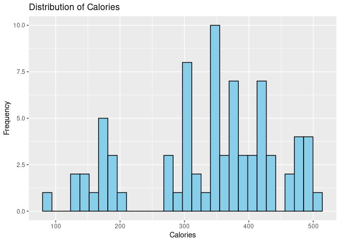
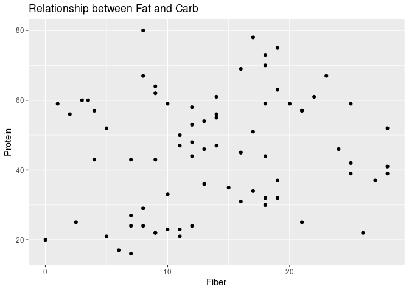
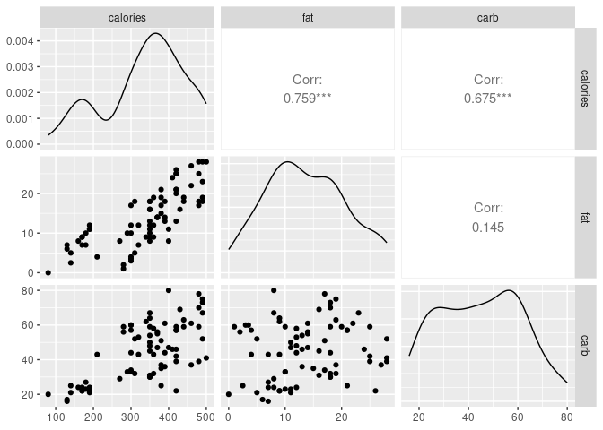
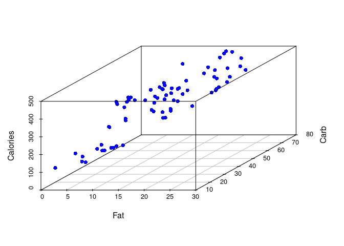

Activity 3 - MLR
================

## Task 2: Load the necessary packages

``` r
library(tidyverse)
```

    ## ── Attaching packages ─────────────────────────────────────── tidyverse 1.3.2 ──
    ## ✔ ggplot2 3.4.2     ✔ purrr   0.3.4
    ## ✔ tibble  3.1.8     ✔ dplyr   1.0.9
    ## ✔ tidyr   1.2.0     ✔ stringr 1.4.1
    ## ✔ readr   2.1.2     ✔ forcats 0.5.2
    ## ── Conflicts ────────────────────────────────────────── tidyverse_conflicts() ──
    ## ✖ dplyr::filter() masks stats::filter()
    ## ✖ dplyr::lag()    masks stats::lag()

``` r
library(tidymodels)
```

    ## ── Attaching packages ────────────────────────────────────── tidymodels 1.0.0 ──
    ## ✔ broom        1.0.4     ✔ rsample      1.1.0
    ## ✔ dials        1.0.0     ✔ tune         1.0.0
    ## ✔ infer        1.0.3     ✔ workflows    1.0.0
    ## ✔ modeldata    1.0.0     ✔ workflowsets 1.0.0
    ## ✔ parsnip      1.0.1     ✔ yardstick    1.0.0
    ## ✔ recipes      1.0.1     
    ## ── Conflicts ───────────────────────────────────────── tidymodels_conflicts() ──
    ## ✖ scales::discard() masks purrr::discard()
    ## ✖ dplyr::filter()   masks stats::filter()
    ## ✖ recipes::fixed()  masks stringr::fixed()
    ## ✖ dplyr::lag()      masks stats::lag()
    ## ✖ yardstick::spec() masks readr::spec()
    ## ✖ recipes::step()   masks stats::step()
    ## • Learn how to get started at https://www.tidymodels.org/start/

``` r
library(ggplot2)
library(dplyr)
library(broom)
```

## Task 3: Load your data

``` r
starbucks<- read_csv("starbucks.csv")
```

    ## New names:
    ## Rows: 77 Columns: 8
    ## ── Column specification
    ## ──────────────────────────────────────────────────────── Delimiter: "," chr
    ## (2): item, type dbl (6): ...1, calories, fat, carb, fiber, protein
    ## ℹ Use `spec()` to retrieve the full column specification for this data. ℹ
    ## Specify the column types or set `show_col_types = FALSE` to quiet this message.
    ## • `` -> `...1`

``` r
head(starbucks)
```

    ## # A tibble: 6 × 8
    ##    ...1 item                        calories   fat  carb fiber protein type  
    ##   <dbl> <chr>                          <dbl> <dbl> <dbl> <dbl>   <dbl> <chr> 
    ## 1     1 8-Grain Roll                     350     8    67     5      10 bakery
    ## 2     2 Apple Bran Muffin                350     9    64     7       6 bakery
    ## 3     3 Apple Fritter                    420    20    59     0       5 bakery
    ## 4     4 Banana Nut Loaf                  490    19    75     4       7 bakery
    ## 5     5 Birthday Cake Mini Doughnut      130     6    17     0       0 bakery
    ## 6     6 Blueberry Oat Bar                370    14    47     5       6 bakery

``` r
starbucks_subset <- starbucks %>% 
  as.data.frame()
```

``` r
glimpse(starbucks)
```

    ## Rows: 77
    ## Columns: 8
    ## $ ...1     <dbl> 1, 2, 3, 4, 5, 6, 7, 8, 9, 10, 11, 12, 13, 14, 15, 16, 17, 18…
    ## $ item     <chr> "8-Grain Roll", "Apple Bran Muffin", "Apple Fritter", "Banana…
    ## $ calories <dbl> 350, 350, 420, 490, 130, 370, 460, 370, 310, 420, 380, 320, 3…
    ## $ fat      <dbl> 8, 9, 20, 19, 6, 14, 22, 14, 18, 25, 17, 12, 17, 21, 5, 18, 1…
    ## $ carb     <dbl> 67, 64, 59, 75, 17, 47, 61, 55, 32, 39, 51, 53, 34, 57, 52, 7…
    ## $ fiber    <dbl> 5, 7, 0, 4, 0, 5, 2, 0, 0, 0, 2, 3, 2, 2, 3, 3, 2, 3, 0, 2, 0…
    ## $ protein  <dbl> 10, 6, 5, 7, 0, 6, 7, 6, 5, 7, 4, 6, 5, 5, 12, 7, 8, 6, 0, 10…
    ## $ type     <chr> "bakery", "bakery", "bakery", "bakery", "bakery", "bakery", "…

**1.Is this an observational study or an experiment?**

-   Its an observational study.

``` r
# To visualize the distribution of a continuous variable like "calories

# Histogram of calories
ggplot(starbucks, aes(x = calories)) +
  geom_histogram(fill = "skyblue", color = "black") +
  labs(x = "Calories", y = "Frequency") +
  ggtitle("Distribution of Calories")
```

    ## `stat_bin()` using `bins = 30`. Pick better value with `binwidth`.

<!-- -->

``` r
## o visualize the frequency or count of different levels of a categorical variable like "type," 

# Bar plot of type
ggplot(starbucks, aes(x = type)) +
  geom_bar(fill = "skyblue", color = "black") +
  labs(x = "Type", y = "Count") +
  ggtitle("Frequency of Types")
```

<!-- -->

**2.Describe the distribution of your response variable. Is the
distribution skewed? Are there any other interesting/odd features
(outliers, multiple peaks, etc.)?**

-   The response variable in the Starbucks dataset is “calories,” which
    represents the number of calories in different food items. To
    describe the distribution of this variable, we can examine its
    histogram.

-   The histogram of the “calories” variable shows that the distribution
    is positively skewed. This means that there is a tail on the right
    side of the distribution, indicating that some food items have
    higher calorie counts.

-   There are outliers in the dataset, particularly on the higher end of
    the calorie spectrum. It is possible that certain food items have
    exceptionally high calorie counts compared to the majority of the
    items.

-   There are multiple peaks or modes in the distribution, indicating
    distinct groups or categories of food items with different calorie
    ranges.

-   Overall, the distribution of the “calories” variable in the
    Starbucks dataset is likely to be positively skewed, suggesting that
    most food items have relatively lower calorie counts, while a few
    items have higher calorie counts. The presence of outliers and
    potential multiple peaks may indicate the existence of different
    categories or types of food items with varying calorie levels.

**3.Excluding your response variable, select two other numeric variables
(hint: look for <dbl> or <int> designations) and describe their
relationship with each other using an appropriate visualization.**

-   We can consider the “fat” and “carb” variables. We can use a scatter
    plot to display the relationship between these two variables.

``` r
# Scatter plot 
scatter_plot <- ggplot(data = starbucks, aes(x = fat, y = carb)) +
  geom_point() +
  xlab("Fiber") +
  ylab("Protein") +
  ggtitle("Relationship between Fat and Carb")

# Display the scatter plot
scatter_plot
```

<!-- -->

-   There appears to be a positive relationship between fat and carbs.
    As the amount of fat increases, the amount of carbs also tends to
    increase.

-   There are a few outliers, indicating some products that have higher
    levels of both fat and carbs compared to the majority of the
    dataset.

## Task 4: Pairwise relationships

``` r
library(GGally)
```

    ## Registered S3 method overwritten by 'GGally':
    ##   method from   
    ##   +.gg   ggplot2

``` r
starbucks_subset<- starbucks %>% 
  select(calories, fat, carb) %>% 
  ggpairs()
print(starbucks_subset)
```

<!-- -->

**1.For each pair of variables, how would you describe the relationship
graphically? Do any of the relationships look linear? Are there any
interesting/odd features (outliers, non-linear patterns, etc.)?**

-   For the variables calories and fat, the points form a roughly
    straight line, it suggests a linear relationship.

-   For the variables calories and carb, the points form a roughly
    straight line, it suggests a linear relationship.

**2.For each pair of variables, how would you describe the relationship
numerically?**

-   A correlation coefficient of 0.759 between the “calories” and “fat”
    variables indicates a moderately strong positive linear
    relationship. This means that there is a tendency for higher-fat
    items to have higher calorie counts, and lower-fat items to have
    lower calorie counts.

-   A correlation coefficient of 0.675 between the “calories” and “carb”
    variables indicates a moderate positive linear relationship. This
    suggests that there is a tendency for food items with higher
    carbohydrate content to have higher calorie counts, and food items
    with lower carbohydrate content to have lower calorie counts.

**3.Are your two explanatory variables collinear (correlated)?
Essentially, this means that adding more than one of these variables to
the model would not add much value to the model.**

-   Based on the correlation coefficient, there is a moderate positive
    correlation between “fat” and “carb” variables.

## Task 5: The multiple linear regression model

``` r
library(ggplot2)
library(parsnip)
library(dplyr)

starbucks_subset <- starbucks %>% 
  as.data.frame()

ggpairs(starbucks_subset, columns = c("calories", "fat", "carb"))
```

<!-- -->

``` r
lm_spec <- linear_reg() %>%
set_mode("regression") %>%
set_engine("lm")

lm_spec
```

    ## Linear Regression Model Specification (regression)
    ## 
    ## Computational engine: lm

``` r
mlr_mod <- lm_spec %>% 
fit(calories ~ fat + carb, data = starbucks_subset)

tidy(mlr_mod)
```

    ## # A tibble: 3 × 5
    ##   term        estimate std.error statistic  p.value
    ##   <chr>          <dbl>     <dbl>     <dbl>    <dbl>
    ## 1 (Intercept)    35.9     12.6        2.85 5.69e- 3
    ## 2 fat            10.0      0.546     18.4  2.83e-29
    ## 3 carb            3.68     0.234     15.7  2.92e-25

**1.Using your output, write the complete estimated equation for this
model.**

-   The estimated equation for the model can be written as:

    Estimated Calories = 35.9 + 10.0 \* Fat + 3.68 \* Carb

-   This equation represents the estimated relationship between the
    variables fat, carb, and calories based on the linear regression
    model. It suggests that the calories can be predicted by adding the
    product of fat with its coefficient (10.0) and the product of carb
    with its coefficient (3.68) to the intercept term (35.9).

**2.For each of the estimated parameters (the y-intercept and the slopes
associated with each explanatory variable - three total), interpret
these values in the context of this problem. That is, what do they mean
for a “non-data” person?**

-   Intercept (y-intercept): The intercept term in the equation is
    estimated to be 35.9. It represents the estimated average calorie
    value when both fat and carb are zero. However, in practical terms,
    it may not have a direct meaningful interpretation since it is
    unlikely to have zero values for both fat and carb in the dataset.

-   Fat (slope for the variable fat): The estimated slope for fat is
    10.0. This means that, holding all other variables constant, a
    one-unit increase in the fat variable is associated with an
    estimated increase of 10.0 calories in the predicted calorie value.
    This suggests that higher levels of fat content in a Starbucks item
    are positively associated with higher calorie content.

-   Carb (slope for the variable carb): The estimated slope for carb is
    3.68. This means that, holding all other variables constant, a
    one-unit increase in the carb variable is associated with an
    estimated increase of 3.68 calories in the predicted calorie value.
    This suggests that higher levels of carbohydrate content in a
    Starbucks item are also positively associated with higher calorie
    content.

## Challenge: 3-D plots

**Create a new R code chunk and add your code to create this plot.**

``` r
library(scatterplot3d)

# Create the scatter plot
scatterplot3d(starbucks_subset$fat, starbucks_subset$carb, starbucks_subset$calories,
              xlab = "Fat", ylab = "Carb", zlab = "Calories",
              color = "blue", pch = 16)
```

<!-- -->

**2.Compare your 3-D scatterplot and the GGally::ggpairs output. Comment
on the strengths and weaknesses of these two visualizations. Do both
display on GitHub when you push your work there?**

-   The 3-D scatterplot created using plotly provides an interactive and
    dynamic visualization of the relationship between the variables. It
    allows you to rotate and zoom the plot, giving you a better
    understanding of the distribution and patterns in the data. This
    type of plot is particularly useful when exploring three continuous
    variables simultaneously.

-   On the other hand, the GGally::ggpairs output provides a matrix of
    scatterplots, where each scatterplot represents the relationship
    between two variables. It is a static visualization that shows
    pairwise relationships between variables. This type of plot is
    useful for quickly identifying patterns and correlations between
    variables.

``` r
library(dplyr)
library(ggplot2)
library(GGally)
library(parsnip)

# Update the "type" variable with two levels
starbucks_bakery <- starbucks %>%
  mutate(type = ifelse(type == "bakery", "bakery", "non-bakery"))

# Convert starbucks dataset to data frame
starbucks_bakery <- as.data.frame(starbucks_bakery)  # Corrected variable name

# Select the variables of interest and create a scatterplot matrix
starbucks_bakery %>%
  select(calories, type) %>%
  ggpairs()
```

    ## `stat_bin()` using `bins = 30`. Pick better value with `binwidth`.

<!-- -->

``` r
# Fit the linear regression model
lm_spec <- linear_reg() %>%
  set_mode("regression") %>%
  set_engine("lm")

mlr_mod <- lm_spec %>% 
  fit(calories ~ type, data = starbucks_bakery)  # Corrected data variable

# Extract model coefficients
tidy(mlr_mod)
```

    ## # A tibble: 2 × 5
    ##   term           estimate std.error statistic  p.value
    ##   <chr>             <dbl>     <dbl>     <dbl>    <dbl>
    ## 1 (Intercept)       369.       15.8     23.4  3.54e-36
    ## 2 typenon-bakery    -64.1      23.1     -2.78 6.93e- 3

**1.What is the label that R assigned to this explanatory variable
term?**

-   The label that R assigned to the explanatory variable term is
    “typenon-bakery”.

**2.What information is represented here?**

-   The information represented in the label “typenon-bakery” is the
    coefficient estimate for the “non-bakery” category of the
    qualitative explanatory variable. It indicates the expected change
    in the response variable (calories) when comparing the “non-bakery”
    category to the reference category (in this case, “bakery”).

**3.What information is missing here?**

-   The label “typenon-bakery” is missing the information about the
    reference category. It only provides information about the
    coefficient estimate for the “non-bakery” category, but it doesn’t
    explicitly mention what the reference category is. In this case,
    since the original variable had two levels (“bakery” and
    “non-bakery”), “bakery” is assumed to be the reference category, but
    it is not explicitly mentioned in the label.

**4.For each level of your qualitative variable, write the simplified
equation of the estimated line for that level. Note that if your
qualitative variable has two levels, you should have two simplified
equations.**

-   For the “bakery” category:

        Intercept term: 369
        Coefficient for "typenon-bakery" level: 0 (since it is the reference level)

    The simplified equation for the “bakery” level can be written as:

    Equation: calories = 369.0 The coefficient for the “typenon-bakery”
    level is not included in the equation because it represents the
    difference from the reference category.

-   For the “non-bakery” category:

    Intercept term: 369 Coefficient for “typenon-bakery” level: -64.1

The simplified equation for the “non-bakery” level can be written as:
calories = 369 - 64.1 Equation: calories = 369.0 - 64.1 \* 1 = 304.9

The coefficient for the “typenon-bakery” level (-64.1) is included in
the equation as it represents the difference from the reference category
(“bakery”).

**5.Interpret the parameter estimate for the reference level of your
categorical variable in the context of your problem**

-   In the context of the problem, the reference level for the
    categorical variable “type” is “bakery”. The parameter estimate for
    the reference level represents the expected difference in the
    average calorie count between the reference level (“bakery”) and the
    other level (“non-bakery”).

-   In this case, the parameter estimate for the reference level is 0.
    This means that, on average, there is no difference in the calorie
    count between the “bakery” products and the reference level.

-   It’s important to note that the reference level is chosen as the
    baseline for comparison, and the parameter estimate for the
    reference level helps establish a baseline expectation. The
    parameter estimate for the reference level allows us to compare the
    other level (“non-bakery”) to this baseline and assess the
    difference in calorie count between the two levels.

**6.Interpret the parameter estimate for your quantitative variable in
the context of your problem.**

-   The term “(Intercept)” represents the parameter estimate for the
    intercept term in the linear regression model.

-   The parameter estimate for the intercept is 369. This estimate
    represents the estimated average value of the response variable
    (calories) when all other explanatory variables in the model are set
    to their reference levels or zero. In other words, it is the
    predicted value of calories for the reference category (bakery) of
    the qualitative variable “type” and for the reference level (zero)
    of the quantitative variable.

**7.Create a new model with the same response and quantitative
explanatory variable, but now choose a qualitative variable with more
than two (but, say, less than 5) levels and obtain the tidy model
output. How does R appear to handle categorical variables with more than
two levels?**

``` r
# Fit the linear regression model with a categorical variable with more than two levels
lm_spec <- linear_reg() %>%
  set_mode("regression") %>%
  set_engine("lm")

mlr_mod <- lm_spec %>% 
  fit(calories ~ type + fat, data = starbucks)

# Extract model coefficients
tidy(mlr_mod)
```

    ## # A tibble: 8 × 5
    ##   term              estimate std.error statistic  p.value
    ##   <chr>                <dbl>     <dbl>     <dbl>    <dbl>
    ## 1 (Intercept)         230.      15.8      14.6   9.26e-23
    ## 2 typebistro box      -27.6     20.3      -1.35  1.80e- 1
    ## 3 typehot breakfast   -35.5     20.1      -1.77  8.13e- 2
    ## 4 typeparfait           7.91    31.9       0.248 8.05e- 1
    ## 5 typepetite         -141.      19.7      -7.17  6.43e-10
    ## 6 typesalad          -150.      54.2      -2.77  7.14e- 3
    ## 7 typesandwich         25.5     21.2       1.20  2.34e- 1
    ## 8 fat                   9.51     0.931    10.2   1.91e-15

-   R handles categorical variables with more than two levels by
    creating separate coefficients for each level compared to a
    reference level. In the tidy model output, we can see one row for
    each level of the categorical variable, along with the corresponding
    estimate, standard error, statistic, and p-value for each level.

``` r
## Task: 2

#fit the mlr model
lm_spec <- linear_reg() %>%
set_mode("regression") %>%
set_engine("lm")

int_mod <- lm_spec %>% 
fit(calories ~ type * fat, data = starbucks)

tidy(int_mod)
```

    ## # A tibble: 14 × 5
    ##    term                  estimate std.error statistic   p.value
    ##    <chr>                    <dbl>     <dbl>     <dbl>     <dbl>
    ##  1 (Intercept)             221.       18.6     11.9    7.93e-18
    ##  2 typebistro box           11.5      58.5      0.197  8.44e- 1
    ##  3 typehot breakfast       -53.2      42.6     -1.25   2.17e- 1
    ##  4 typeparfait              79.0      61.2      1.29   2.01e- 1
    ##  5 typepetite              -85.1      98.3     -0.866  3.90e- 1
    ##  6 typesalad              -141.       55.1     -2.56   1.29e- 2
    ##  7 typesandwich            105.       58.0      1.81   7.54e- 2
    ##  8 fat                      10.1       1.15     8.81   1.20e-12
    ##  9 typebistro box:fat       -2.26      3.07    -0.736  4.65e- 1
    ## 10 typehot breakfast:fat     1.33      2.72     0.491  6.25e- 1
    ## 11 typeparfait:fat         -10.1       7.78    -1.30   1.97e- 1
    ## 12 typepetite:fat           -5.66     10.2     -0.553  5.82e- 1
    ## 13 typesalad:fat            NA        NA       NA     NA       
    ## 14 typesandwich:fat         -5.40      3.67    -1.47   1.46e- 1

**1.When viewing the tidy output, notice that the interaction term is
listed as qualitativelevel:quantitative. Referring back to Day 2 with
how R displays qualitative variables, interpret what this syntax
means.**

-   When R displays the interaction term in this format, it indicates
    that the model has included an interaction effect between the
    qualitative variable and the quantitative variable, specifically
    focusing on a particular level of the qualitative variable.

-   The “qualitativelevel” represents a specific level of the
    qualitative variable, and “quantitative” represents the quantitative
    variable.

-   Interpreting this syntax, we can understand that R is accounting for
    the interaction between the specific levels of the qualitative
    variable and the quantitative variable in the model, allowing us to
    estimate the effects of these interactions on the response variable.

**2.Write the simplified equation of the line corresponding to each
level of your qualitative explanatory variable.**

-   For the “typebistro box” level: response = (Intercept) +
    estimate\_typebistro box + estimate\_fat \* fat +
    estimate\_typebistro box:fat \* fat

-   For the “typehot breakfast” level: response = (Intercept) +
    estimate\_typehot breakfast + estimate\_fat \* fat +
    estimate\_typehot breakfast:fat \* fat

-   For the “typeparfait” level: response = (Intercept) +
    estimate\_typeparfait + estimate\_fat \* fat +
    estimate\_typeparfait:fat \* fat

-   For the “typepetite” level: response = (Intercept) +
    estimate\_typepetite + estimate\_fat \* fat +
    estimate\_typepetite:fat \* fat

-   For the “typesalad” level: response = (Intercept) +
    estimate\_typesalad + estimate\_fat \* fat +
    estimate\_typesalad:fat \* fat

-   For the “typesandwich” level: response = (Intercept) +
    estimate\_typesandwich + estimate\_fat \* fat +
    estimate\_typesandwich:fat \* fat

**3.For two observations with similar values of the quantitative , which
level tends to have higher values of the response variable?**

-   The “typesandwich” level has the highest estimate (105.0) among all
    the levels of the qualitative variable. Therefore, for two
    observations with similar values of the quantitative variable, the
    “typesandwich” level tends to have higher values of the response
    variable compared to the other levels.

**4.How does int\_mod’s fit compare to mlr\_mod? What did you use to
compare these? Why?**

-   To compare the fits of int\_mod and mlr\_mod, we can use the model’s
    R-squared values. The R-squared value is a measure of how well the
    model fits the data, indicating the proportion of the variance in
    the response variable that can be explained by the model.

-   A higher R-squared value indicates a better fit, as it indicates a
    larger proportion of the variance in the response variable is
    accounted for by the model.

-   By comparing the R-squared values of int\_mod and mlr\_mod, we can
    assess the relative goodness of fit of the two models and determine
    which one provides a better explanation of the data.

``` r
# null model
null_mod <- lm_spec %>% 
fit(calories ~ 1, data = starbucks)

anova(
  extract_fit_engine(int_mod),
  extract_fit_engine(null_mod)
)
```

    ## Analysis of Variance Table
    ## 
    ## Model 1: calories ~ type * fat
    ## Model 2: calories ~ 1
    ##   Res.Df    RSS  Df Sum of Sq      F    Pr(>F)    
    ## 1     64 172184                                   
    ## 2     76 843795 -12   -671611 20.803 < 2.2e-16 ***
    ## ---
    ## Signif. codes:  0 '***' 0.001 '**' 0.01 '*' 0.05 '.' 0.1 ' ' 1

**5.what is the F test statistic and p-value for this test? Based on an
alpha =0.05 significant level, what should you conclude.**

-   Test statistic (F): The test statistic is 20.803.

-   p-value (Pr(&gt;F)): The p-value is less than 2.2e-16, which is a
    very small value.

-   Since the p-value is much smaller than 0.05, we reject the null
    hypothesis and conclude that at least one predictor is useful in the
    model.

-   In other words, there is strong evidence to suggest that the
    interaction between the type and fat predictors has a significant
    impact on the response variable (calories).

**6.What is the t test statistic and p-value associated with this test?
Based on an alpha=0.05 significant level, what should you conclude?.**

-   F-test statistic: 20.803 p-value: &lt; 2.2e-16 (which means it is
    extremely small)

-   Since the p-value is much smaller than 0.05 (p &lt; 0.05), we reject
    the null hypothesis. This indicates that there is strong evidence to
    suggest that at least one predictor in Model 1 (calories \~ type \*
    fat) is useful in explaining the variation in the response variable
    (calories), compared to the null model (Model 2: calories \~ 1).
